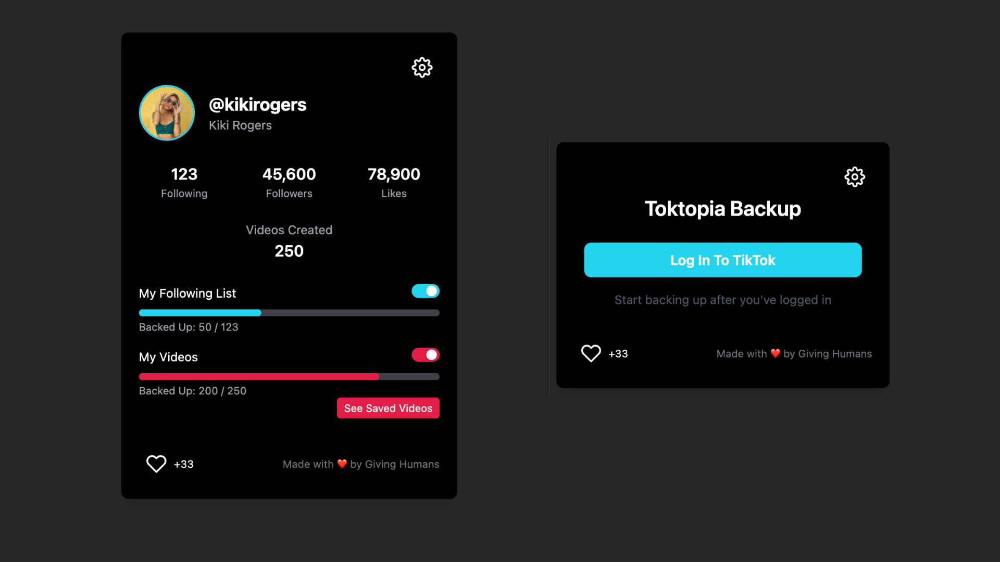

# Toktopia
### Back Up Your TikTok Content with Ease  
Toktopia is a **free** and **open-source** Chrome extension that helps you back up your TikTok videos, profile info, and Following list—directly to your browser storage.

* Back up all your TikTok **video** 🎥 posts to your local browser
    * Keep all your videos and upload them anywhere else
    * View your videos in the Chrome side panel, even if you are offline
 
* Back up your TikTok **Following** list 👩‍🦰 📋 to your local browser
    * Keep these contacts safe, making them capable of being rediscovered in other networks

## Step 1: Download and Unpack the Extention

* To use this Chrome Extention from here, first download the .zip File here:
👉 [Download .zip File](https://github.com/mullojo/Toktopia/archive/refs/heads/main.zip) 💾 

* You'll see the file in your **Downloads** 📂 folder

* Click the .zip file to Unpack it 📦 📂

* You'll now see a folder called **Toktopia-main** 📂

## Step 2: Load the Extention In Chrome

👉 Go to your Chrome browser and enter this path: 

    chrome://extensions/
    
You can also navigate there with the Chrome menu: "Menu" -> "Extensions" -> "Manage Extensions"

* In the upper right, toggle the switch that says **Developer mode** 🎚️

* You'll see some new buttons, click on the **Load unpacked** button 🔘 and select the **Toktopia-main** 📂 folder

* On the Chrome toolbar, click the Extensions puzzle 🧩 button and then the pin 📌 button for Toktopia

* Now you're ready to use Toktopia for your account backups, click the Toktopia button and navigate to your TikTok profile page ✔️

# Backing Up

## 🌟 How to Use Toktopia

### Step 1: Log in to TikTok & Go to Your Profile
1. If you're not already logged into TikTok, log in first.  
2. Go to your **Profile** page.
3. Click the Toktopia button on your browser to see the popup loads your info.
4. If it all looks good, your Profile is backed up ✅

### Step 2: Back Up Your Following List  
1. Click your **"Following"** tab and scroll through your list to back it up.
2. Check the progress bar in the Toktopia popup to ensure you’ve captured the entire list.
3. You can toggle the "My Following List" to **Off** when you are done (it will turn off further backups)

### Step 3: Back Up Your Videos  
1. Make sure you are on your TikTok **Videos** tab.
2. Slowly scroll through your video list:  
   - Hover your mouse over each video to make sure it animates.
   - Wait for the video to animate before hovering to the next one.
3. Check the progress bar update as your videos are backed up.  
   - **Pro Tip:** Longer videos may take more time to back up, so be patient!

### Step 4: View Your Saved Videos  
- Click the red **"View Saved Videos"** button in the Toktopia popup to open the side panel and see your backed-up content.
- Click the menu button on each video if you want to save individual videos to a folder on your computer.

### Important Notes:  
- **Local Storage:** Your data is stored locally in your browser. It’s safe as long as you don’t clear your browser cache or remove the Toktopia extension. 
- **Privacy First:** All backups are private and remain entirely on your device.
- **Future Updates:** We're planning to release future features to offload all your backed up data to your hard drive or to your private cloud providers

# Why Toktopia is Great!

## 🌟 Features  
- **💾 Stay Prepared:** Keep your TikTok content safe in case of bans or account changes.  
- **🎁 100% Always Free:** No ads, no paywalls—forever free.  
- **🌎 Open Source:** Transparent and community-driven. View the code, suggest changes, or remix it on your own.  
- **🔐 Privacy First:** Your data stays on your device—nothing is sent to the cloud or any external servers.  

## ✨ What You Can Back Up  
1. **Your Profile Info:** Save details about your TikTok account.  
2. **Your Following List:** Preserve the list of creators you follow to reconnect on other platforms.  
3. **Your Videos:** Back up all your TikTok videos for safekeeping or future use.  

## 📍 Where Is Everything Saved?  
Toktopia uses **IndexedDB**, a secure and local database in your browser.  
- Your content stays on your device with a **local-first design**—no cloud required.  
- No extra hard drive or external storage needed—it’s all handled by your browser.  

## 💻 For Developers  
- **Open Source:** Contribute to Toktopia, suggest improvements, or fork the repo to build your own version.  
- **Local-First Architecture:** Built with IndexedDB to ensure privacy and simplicity.  
- **No External Network Dependencies:** Everything runs locally, so there’s no need to worry about external servers. 

