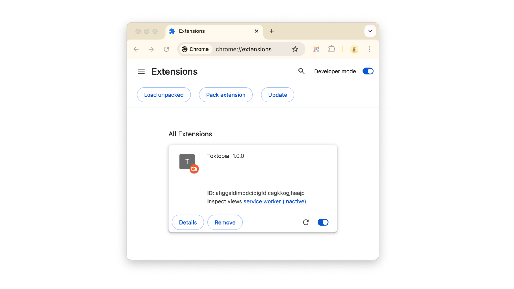

# Toktopia
Toktopia browser extension

## Step 1: Download and Unpack the Extention

To use this Chrome Extention from here, first download the .zip File here:
👉 [Download .zip File](https://github.com/mullojo/Toktopia/archive/refs/heads/main.zip) 💾 

You'll see the file in your **Downloads** 📂 Folder 

Double Click the .zip file to Unpack it 📦

You'll now see a folder called **Toktopia-main** 📂

## Step 2: Load the Extention In Chrome

👉 Go to your Chrome browser and enter this path: 

    chrome://extensions/
    
You can also navigate there with the Chrome menu: "Popup Menu" -> "Extensions" -> "Manage Extensions" 

In the upper right, toggle 🔘 the switch that says **Developer Mode**

You'll see some new buttons, click on the **Load unpacked** button 🔘 and select the **Toktopia-main** 📂 Folder 

